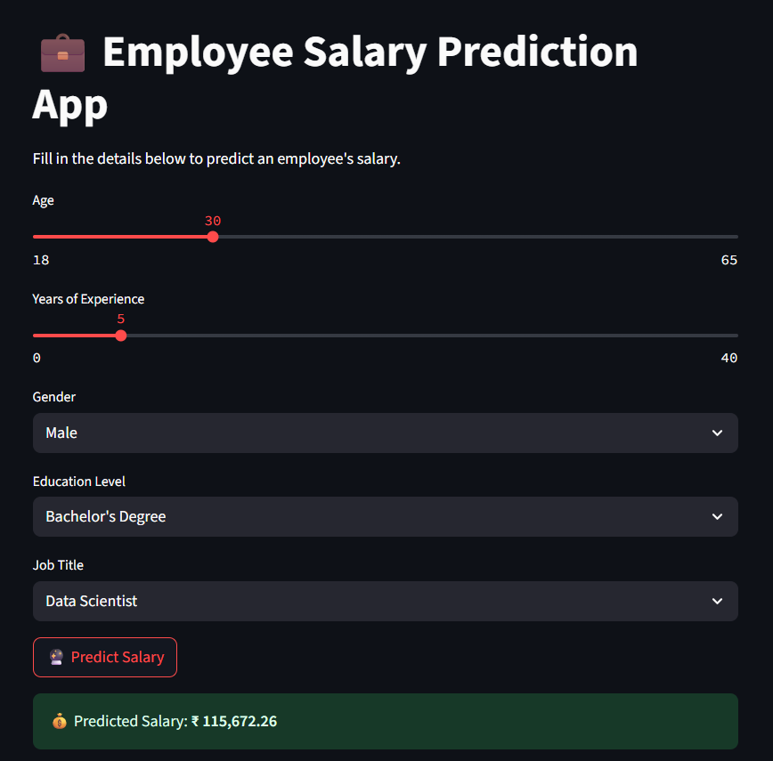

# 💼 Employee Salary Predictor

## 🔍 Project Overview

This project is a **Machine Learning application** that predicts employee salaries based on demographic and professional attributes.  
It combines **Exploratory Data Analysis (EDA)**, **model training**, and a **Streamlit web app** for real-time predictions.  

The aim is to help businesses estimate fair salaries, identify pay patterns, and make data-driven HR decisions.  

---

## 📁 Project Files

| File Name | Description |
|---|---|
| `Employee_Salary_Predictor.ipynb` | Jupyter Notebook with the complete workflow — data cleaning, EDA, feature engineering, model training, and evaluation. |
| `salary.csv` | The dataset used for training and exploratory analysis. |
| `app.py` | Streamlit web app for interactive salary prediction. |
| `model.pkl` | Trained machine learning model. |
| `scaler.pkl` | Pre-fitted scaler for normalizing numeric features. |
| `encoder.pkl` | Pre-fitted encoder for handling categorical variables. |
| `meta.pkl` | Metadata storing feature names and categories. |
| `README.md` | Project documentation (this file). |

---

## 📊 Key Project Components

### 📈 Exploratory Data Analysis (EDA)
- Distribution of salaries across industries and experience levels.  
- Correlation between features like **age**, **experience**, and **job role** with salary.  
- Detection and treatment of outliers and missing values.  

---

### 🧠 Model Training
- Feature scaling and categorical encoding using **scikit-learn**.  
- Multiple regression-based models tested, with the best-performing one saved as `model.pkl`.  
- Evaluation using metrics such as **R²** and **RMSE**.  

---

### 🌐 Streamlit App
- User-friendly interface to input employee details.  
- Supports **numeric inputs** (e.g., age, experience) and **categorical inputs** (e.g., role, department).  
- Instant salary predictions displayed in INR 💰.

---  

## 📸 App Preview

When you launch the app, you’ll see:

- Sliders for **age** and **experience**.  
- Dropdowns for **categorical fields** like job role, department, etc.  
- A **Predict Salary** button that displays the predicted value in INR.  

  

---

## ✅ Business Value

- **Fair Salary Estimation:** Helps HR teams ensure transparency in compensation.  
- **Data-Driven Hiring Decisions:** Predict salaries for new roles or regions.  
- **Market Insights:** Understand how factors like skills, location, and experience affect salary trends.  

---

## 🛠 Tools & Technologies

- **Python:** Core programming language.  
- **Pandas & NumPy:** Data preprocessing and manipulation.  
- **Matplotlib & Seaborn:** Visualizations for EDA.  
- **Scikit-learn:** Model training, scaling, and encoding.  
- **Streamlit:** Web-based prediction app.  
- **Joblib:** Saving and loading trained models.  

---

## 📧 Contact

For any feedback or collaboration opportunities:  
**Author**: Sarthak Salvi  
**Email**: [sarthaksalvi2107@gmail.com](mailto:sarthaksalvi2107@gmail.com)

---

> ⭐ If you found this project insightful, consider starring this repository!

